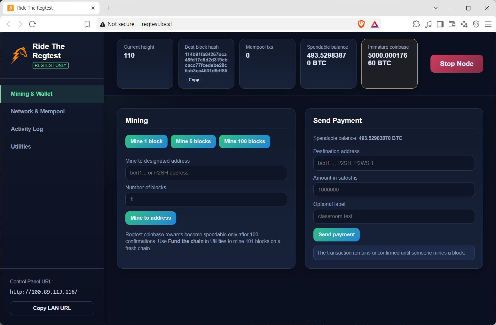

# Ride The Regtest

A Node.js-based control panel for a Bitcoin Core **regtest** node on Windows.



- Built with Node.js and Express
- Simple zero-dependency architecture
- Browser never receives RPC credentials
- Normal node operations use JSON-RPC, not `bitcoin-cli.exe`
- `spawn()` is used only to launch `bitcoind.exe` detached
- RPC is bound to `127.0.0.1`; only the Node.js server is exposed to the LAN

## 1. Install the project

Clone the repository and install dependencies:

```bat
git clone https://github.com/ErnestoQuezada/ride-the-regtest.git
cd ride-the-regtest
npm install
```

Copy Bitcoin Core's executables into the same directory:

```text
bitcoind.exe
bitcoin-cli.exe
```

Use matching versions of `bitcoind.exe` and `bitcoin-cli.exe`.

## 2. Run the panel

Open Command Prompt and run:

```bat
node rtrt
```

The first time it runs, it will automatically generate the required configuration files (RPC user/pass, admin password, etc.) inside `config/config.json` and `data/bitcoin.conf`. The admin password will be printed to the console.

## 3. Usage

Access the panel in your browser at:
`http://localhost:8080/`

To use a different port, you can either set the `PORT` environment variable before starting:
```bat
set PORT=3000
node rtrt
```
Or you can edit `config/config.json` and add `"port": 3000` to the configuration.
